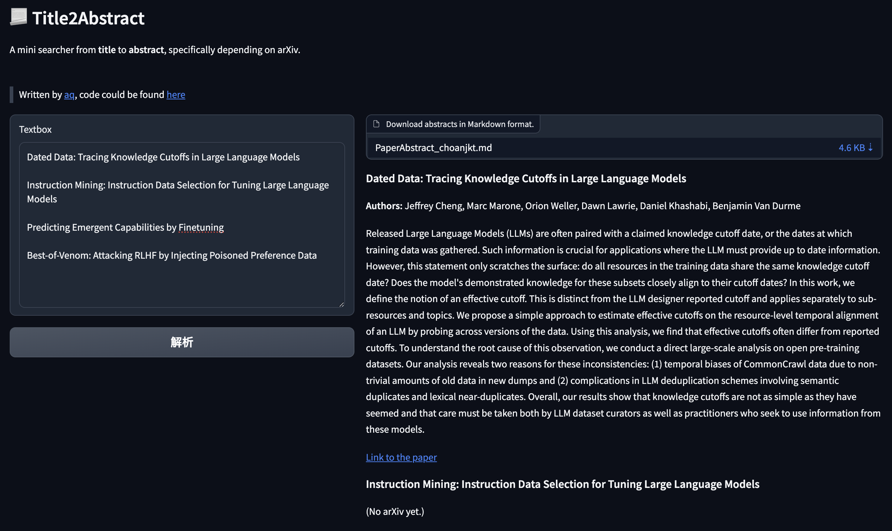

# Title2Abs

**Can't wait to read the most up-to-date accepted papers.**

**But be tired of search the paper one by one?**

Start to use **Title2Abs** with a [web demo](http://ucashomework.icu:7860/) here!

*Fig: The demo page of Title2Abs. You can easily input the titles in the left box, and wait for the Markdown format abstract information in the right box. The exported infomation also supports a free download.*

## Quick setup

(Placeholder for tutorial)

```bash
conda create -n title2abs python=3.10
pip install beautifulsoup4
```